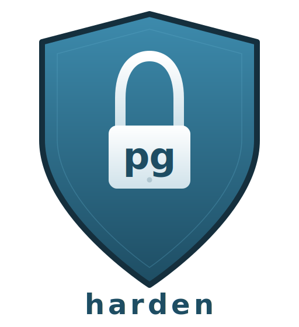

<p align="center">
  
</p>

<h3 align="center">Security hardening tool for PostgreSQL</h3>

<p align="center">
  Single binary. Single connection. Bare metal, containers, and managed cloud.
</p>

<p align="center">
  <a href="https://github.com/pscheid92/pgharden/actions/workflows/ci.yml"></a>
  <a href="https://codecov.io/gh/pscheid92/pgharden"></a>
  <a href="LICENSE"></a>
</p>

---

- **90 security checks** across 8 categories — logging, authentication, encryption, replication, and more
- **Source-attributed** — each check declares its origin (currently [CIS PostgreSQL 16 Benchmark](https://www.cisecurity.org/benchmark/postgresql)); filter with `--source`
- **Environment-aware** — auto-detects platform, version, and privileges; gracefully skips what can't run
- **Three output formats** — colored terminal text, JSON for pipelines, self-contained HTML reports
- **Zero dependencies** — single static binary, connects via [pgx](https://github.com/jackc/pgx), no `psql` or Perl needed

## Quick Start

```bash
# Build from source
git clone https://github.com/pscheid92/pgharden.git && cd pgharden && make build

# Run a scan
pgharden -H localhost -U postgres -d postgres

# HTML report
pgharden -H localhost -U postgres -d postgres -f html -o report.html

# Only CIS benchmark checks
pgharden -H localhost -U postgres -d postgres --source cis

# Only logging section
pgharden -H localhost -U postgres -d postgres --section 3
```

Works out of the box against RDS, Aurora, containers, and non-superuser roles — checks that require unavailable capabilities are automatically skipped.

See [docs/usage.md](docs/usage.md) for connection options, filtering, config files, CI/CD integration, and exit codes.

## Security Checks

90 checks across 8 sections:

1. **Installation and Patches** — repositories, systemd, checksums, version, extensions
2. **Directory and File Permissions** — umask, PGDATA, pg_hba.conf, socket permissions
3. **Logging and Auditing** — log destinations, syslog, pgAudit, debug settings
4. **User Access and Authorization** — superusers, SECURITY DEFINER, RLS, public schema
5. **Connection and Login** — authentication methods, SSL, CIDR ranges, password encryption
6. **PostgreSQL Settings** — runtime parameters, TLS, ciphers, FIPS, timeouts
7. **Replication** — replication users, WAL archiving, streaming parameters
8. **Special Configuration** — backup tools, external file references

See [docs/checks.md](docs/checks.md) for the full reference with requirements and platform compatibility.

## Documentation

- [docs/usage.md](docs/usage.md) — Connection, filtering, config files, output formats, and exit codes
- [docs/checks.md](docs/checks.md) — Complete check reference with platform compatibility matrix
- [docs/architecture.md](docs/architecture.md) — Package layout, pipeline, interfaces, and testing

## Acknowledgments

The security checks in pgharden are derived from [pgdsat](https://github.com/darold/pgdsat) by Gilles Darold (HexaCluster Corp), originally licensed under GPLv3. pgharden is a clean-room reimplementation in Go — no Perl source code was copied — but the check logic, SQL queries, and expected values are based on his work.

Check descriptions reference the [CIS PostgreSQL Benchmark](https://www.cisecurity.org/benchmark/postgresql), licensed under [Creative Commons BY-NC-SA 4.0](https://creativecommons.org/licenses/by-nc-sa/4.0/).

## License

GPLv3 — see [LICENSE](LICENSE).
